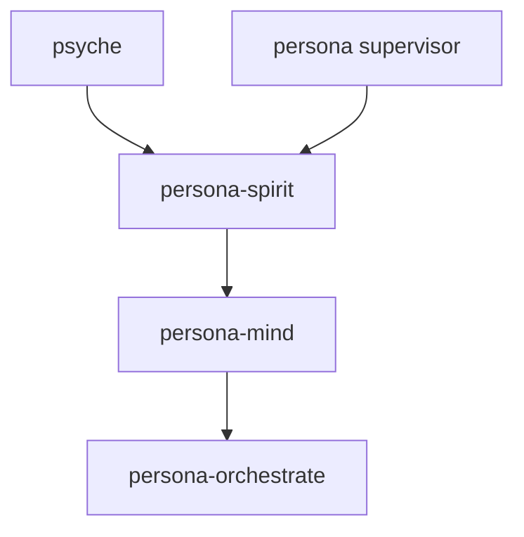
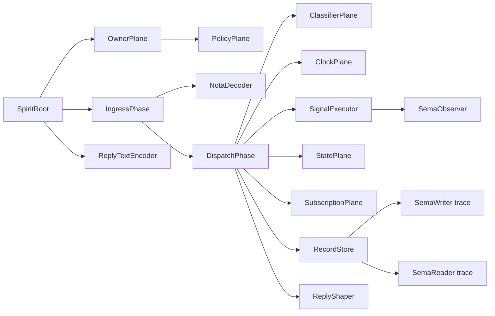
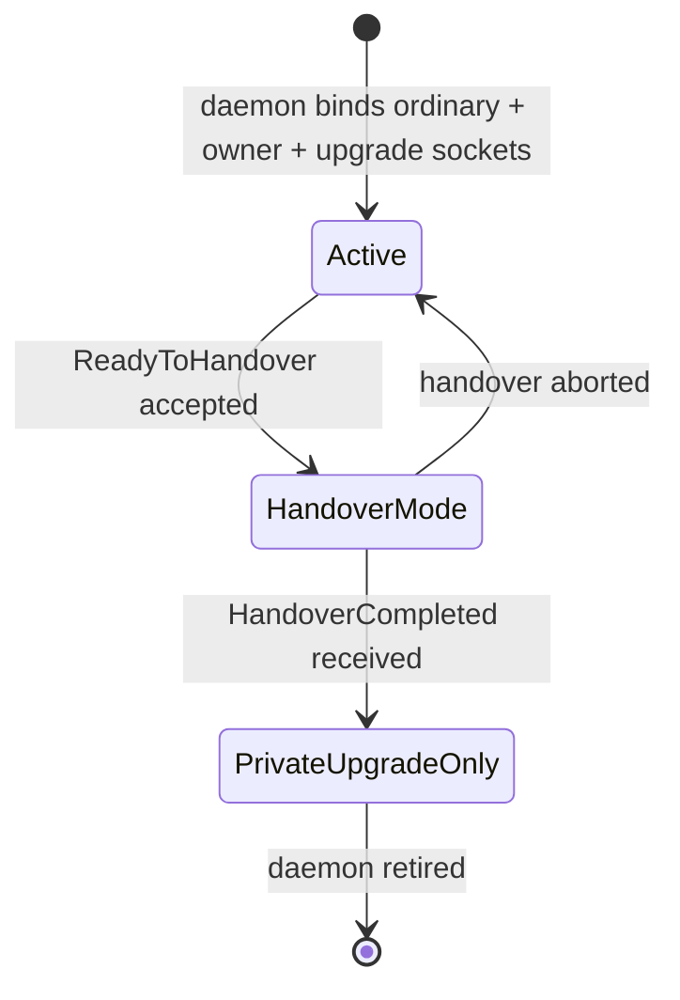

# persona-spirit — architecture

*Psyche ↔ mind interface; apex cognitive component of Persona.*

## Role

`persona-spirit` receives psyche statements, captures intent, and projects
typed intent into `persona-mind`. It is the cognitive authority above mind.
The supervisor has higher infrastructure permission only for process
lifecycle.

`persona-spirit` follows the component triad:

- `persona-spirit` — runtime daemon + thin CLI.
- `signal-persona-spirit` — ordinary peer-callable contract.
- `owner-signal-persona-spirit` — supervisor-only owner contract.

## Authority



Spirit is spawned last because it depends on the components it commands.

## State

`persona-spirit` owns one sema-engine database: `persona-spirit.redb`.

Policy state is seeded once from `bootstrap-policy.nota` unless
`DaemonConfiguration` names an explicit bootstrap-policy path. It is then
changed only through `owner-signal-persona-spirit`. Working state records
captured intent, psyche presence, pending clarification questions, and
downstream owner-Mutate audit once the runtime lands.

## Actor topology

The daemon keeps the Kameo actor tree alive behind three typed Unix sockets:



`OwnerPlane` handles owner-only lifecycle and identity requests carried by
`owner-signal-persona-spirit`; it is not reachable through the ordinary text
ingress or dispatch path. `PolicyPlane` owns bootstrap-policy parsing and
reload state. `ClassifierPlane` owns the current conservative statement-to-record
policy. `ClockPlane` owns daemon-side capture-time stamping; clients never
submit capture time. `DispatchPhase` is the boundary where ordinary operations
enter `signal-executor`: it lowers contract operations into Spirit-local
`Command` values, executes them through the Kameo planes, and publishes
payloadless `signal-sema` observations after successful execution. `RecordStore`
owns `SpiritStore`, which owns the sema-engine handle. It runs as the store
plane.
`StatePlane` owns current psyche state and pending clarification questions.
`SubscriptionPlane` owns subscription tokens and live stream registrations.
Request decoding, dispatch,
unimplemented-reply shaping, and NOTA reply rendering are separate actor
planes. `ActorTrace` is a runtime witness, not an audit log: tests assert the
expected actor path for each constraint.

The daemon socket path does not pretend RKYV Signal traffic is text. The
ordinary socket reads length-prefixed `signal-persona-spirit::Frame` values,
checks the `signal-frame::Request`, and submits each working-contract
`Operation` directly to `SpiritRoot` through the dispatch plane. When
`DaemonConfiguration` names a handoff-control socket, the daemon also connects
to Persona's control socket and can receive accepted public-client file
descriptors by `SCM_RIGHTS`; each received descriptor is treated as the same
ordinary length-prefixed Signal stream, so Persona is not on the byte path after
handoff. A received descriptor is already admitted by Persona, so it can drain
even if this daemon later closes its public sockets during handover; direct
ordinary-socket traffic still obeys the daemon's current public-socket state.
The owner socket reads length-prefixed
`owner-signal-persona-spirit::Frame` values and submits each owner-contract
`Operation` directly to `OwnerPlane`.

The upgrade socket reads length-prefixed `signal-version-handover::Frame`
values. It is the private handover surface for a staged Spirit replacement:
`AskHandoverMarker` reads the store's current commit sequence and last record
identifier, `ReadyToHandover` accepts only when the source marker still matches
the local store, and `HandoverCompleted` finalizes only after a matching
accepted readiness marker while the store marker remains unchanged. Completion
then removes the ordinary and owner socket paths. The upgrade socket also
applies the first mirrored write payload shape:
`RecordKind("StampedEntry")` with component-private rkyv bytes. Broader
cross-version projection remains the next step before a zero-downtime cutover
can replace the temporary sema-upgrade runner.

The daemon advances through three handover states:



- **Active** — ordinary, owner, and upgrade sockets all serve their
  respective contracts; public writes accepted. The steady state.
- **HandoverMode** — ordinary and owner sockets remain bound. Current
  implementation freezes public writes so the accepted marker remains
  stable through completion; ordinary reads remain available. If
  Persona cannot complete the cutover, `RecoverFromFailure` returns the
  daemon to `Active` before public socket paths are removed.
- **PrivateUpgradeOnly** — ordinary and owner socket paths removed;
  only the upgrade socket remains bound; the daemon receives mirrored
  `StampedEntry` writes from next if old-compat reads still consume the
  previous shape, then retires.

The `spirit` CLI is not a second runtime. It resolves its single argument as
either a raw NOTA request record (argument begins with `(`) or a path to a NOTA
request file, peeks the request record head, routes it through the generated
`signal-frame::signal_cli!` table, and then decodes against the selected
contract. Working requests become length-prefixed `signal-persona-spirit`
frames on `PERSONA_SPIRIT_SOCKET`; owner requests become length-prefixed
`owner-signal-persona-spirit` frames on `PERSONA_SPIRIT_OWNER_SOCKET`. The CLI
encodes the selected daemon reply back to NOTA. If the selected socket is not
configured, the CLI fails instead of opening a store or running the actor tree
in-process.

## Constraints

| Constraint | Witness |
|---|---|
| The `spirit` CLI accepts exactly one argument. | `tests/boundary.rs` checks missing and extra arguments. |
| The daemon binary accepts exactly one argument. | `tests/boundary.rs` checks the shared argument parser. |
| The CLI routes request heads through generated working/owner contract metadata before full decode. | `persona_spirit_generated_dispatch_routes_working_and_owner_heads` and `persona_spirit_request_head_uses_generated_dispatch_before_full_decode` check the generated table. |
| The CLI type-checks one selected contract request. | `tests/boundary.rs` checks valid working `State`, `Record`, and `Observe` requests and owner `Register` requests before daemon submission. |
| The CLI requires the selected daemon socket instead of using an in-process store fallback. | `persona_spirit_binary_requires_socket_environment` runs a working request without `PERSONA_SPIRIT_SOCKET`; `persona_spirit_binary_requires_owner_socket_for_owner_requests` runs an owner request without `PERSONA_SPIRIT_OWNER_SOCKET`. |
| The CLI path only translates NOTA to Signal frames and Signal replies to NOTA. | `persona_spirit_command_line_path_does_not_use_actor_runtime_directly` checks `runtime.rs` uses working/owner request text, signal clients, generated dispatch, and reply text, and not `SpiritActorRuntime` or `StoreLocation`. |
| The CLI accepts a path to a NOTA request file. | `persona_spirit_client_accepts_request_file_path_argument` writes a request file, invokes the same client path, and checks daemon-backed persistence. |
| Spirit-local commands project to payloadless Sema operation labels. | `tests/sema_projection.rs` checks `Command::from_request` and `ToSemaOperation` through real actor-runtime requests. |
| Spirit-local effects project to payloadless Sema outcome labels. | `tests/sema_projection.rs` checks `Effect::from_reply`, `ToSemaOutcome`, and `SemaObservation` after real actor-runtime replies. |
| Sema observations do not carry Spirit payloads. | `tests/sema_projection.rs` expects only `SemaOperation` plus `SemaOutcome` for assert, match, subscribe, and retract paths. |
| Ordinary requests execute through `signal-executor`, not a hand-rolled request match. | `persona_spirit_ordinary_request_path_uses_signal_executor_and_sema_observer` and `persona_spirit_dispatch_path_depends_on_signal_executor` check runtime trace and source dependency. |
| Multi-operation ordinary batches do not pretend to be atomic until the store supports atomic batch execution. | `persona_spirit_daemon_rejects_multi_operation_batches_before_any_commit` expects `BatchAborted` with `NotCommitted` and an empty later query. |
| Spirit's current atomicity is degenerate: one operation lowers to one command, and multi-operation batches or multi-command operation plans are rejected before any command runs. | `persona_spirit_daemon_rejects_multi_operation_batches_before_any_commit` verifies batch rejection-before-commit; `spirit_rejects_multi_command_operation_plan_before_execution` verifies multi-command plans cannot execute sequentially without a transaction. |
| Accepted no-change paths still project through explicit Spirit-local commands. | `spirit_unimplemented_observer_operations_project_as_explicit_no_change_commands` checks valid-but-unimplemented `Tap` / `Untap` requests become `Subscribe` / `Retract` commands with `NoChange` outcomes. |
| Kameo is the only actor runtime dependency. | `persona_spirit_uses_kameo_as_only_actor_runtime` scans the manifest. |
| Actor types are data-bearing, not public zero-sized actor nouns. | `persona_spirit_actor_types_are_data_bearing` checks each named actor has a struct body. |
| Raw `State` statements route through a classifier actor before storage. | `persona_spirit_state_statement_uses_classifier_before_store` checks `DispatchPhase` → `ClassifierPlane` → `RecordStore` → `SemaWriter`. |
| The provisional classifier preserves the raw quote and marks uncertainty. | `persona_spirit_client_classifies_statement_as_provisional_record` checks `Clarification` / `Minimum` output. |
| `Record` operations traverse root, ingress, decoder, dispatch, daemon clock, store, sema writer, and reply encoder. | `persona_spirit_entry_assertion_runs_through_actor_planes` checks `ActorTrace` ordering. |
| `Record` operations persist a top-level record. | `persona_spirit_client_asserts_entry_and_mints_record_identifier` checks `RecordAccepted`. |
| Submitted `Entry` records carry no client-provided capture time. | `persona_spirit_client_asserts_entry_and_mints_record_identifier` submits topic, kind, summary, context, certainty, and quote only; `persona_spirit_client_rejects_opaque_integer_timestamp_shape` and `persona_spirit_client_rejects_parenthesized_date_time_shape` reject old timestamp-bearing shapes. |
| The daemon stamps capture time before storage. | `persona_spirit_ordinary_request_path_uses_signal_executor_and_sema_observer` checks `ClockPlane` and `EntryStamped`; provenance replies include daemon-produced `Date` and `Time`. |
| Spirit mints `RecordIdentifier`; agents never submit it. | `persona_spirit_client_asserts_entry_and_mints_record_identifier` sends no identifier and receives one. |
| Repeated similar entries remain distinct records. | `persona_spirit_client_repeated_entries_remain_distinct_records` stores two matching summaries. |
| Record observations use the read plane and not the write plane. | `persona_spirit_record_observation_uses_read_plane_without_write_plane` checks `SemaReader` without `SemaWriter`. |
| Record observations filter by topic and kind inside the daemon store read path. | `persona_spirit_client_filters_record_observation_by_topic`, `persona_spirit_client_filters_record_observation_by_kind`, and `persona_spirit_client_filters_record_observation_by_topic_and_kind` store multiple records and expect only matching summaries. |
| Topic catalog observations list each topic with an entry count without reading every entry's provenance. | `persona_spirit_client_lists_topics_with_entry_counts`, `persona_spirit_topic_catalog_observation_uses_read_plane_without_write_plane`, and `persona_spirit_daemon_serves_topic_catalog_through_signal_frames` store multiple topics and expect deterministic counts through the daemon read plane. |
| Psyche-state observations use a working-state plane, not record storage. | `persona_spirit_state_observation_uses_state_plane` checks `StatePlane` without `RecordStore`. |
| Pending-question observations use the working-state plane. | `persona_spirit_question_observation_uses_state_plane` and `persona_spirit_client_observes_empty_pending_questions` check the empty raw state. |
| State subscriptions snapshot current psyche state through the state plane before opening a stream. | `persona_spirit_state_subscription_uses_subscription_plane_after_state_snapshot` checks `StatePlane` before `SubscriptionPlane`. |
| Record subscriptions snapshot record summaries through the read plane before opening a stream. | `persona_spirit_record_subscription_uses_read_plane_then_subscription_plane` checks `SemaReader` before `SubscriptionPlane`. |
| Subscription retractions use the subscription plane and return typed retraction acknowledgements. | `persona_spirit_subscription_retractions_use_subscription_plane` checks `SubscriptionRetracted` with state and record token variants. |
| Summary queries do not include provenance. | `persona_spirit_client_persists_entries_for_later_summary_observation` checks `RecordsObserved`. |
| Provenance appears only when requested. | `persona_spirit_client_returns_provenance_only_when_requested` checks `RecordProvenancesObserved`. |
| Valid unimplemented requests do not touch the store. | `persona_spirit_unimplemented_observer_request_uses_reply_shaper_not_store` checks `ReplyShaper` and absence of `RecordStore`, `SemaWriter`, and `SemaReader`. |
| Invalid NOTA keeps a typed decode error through the actor path. | `persona_spirit_invalid_text_keeps_typed_decode_error` checks `Error::InvalidSpiritRequest`. |
| Shutdown releases the store so a later runtime can reopen the same path. | `persona_spirit_shutdown_releases_store_for_restart` writes, stops, restarts, and reads. |
| Owner lifecycle requests route through `OwnerPlane`, not the ordinary dispatch path. | `persona_spirit_owner_lifecycle_orders_use_owner_plane` checks `Started` / `DrainedAndStopped` replies and no dispatch/store trace. |
| Owner identity requests route through `OwnerPlane`. | `persona_spirit_owner_identity_orders_use_owner_plane` checks register/retire replies. |
| Bootstrap-policy reload uses the policy plane. | `persona_spirit_bootstrap_policy_reload_uses_policy_plane` returns `BootstrapPolicyReloaded` and checks the `OwnerPlane` → `PolicyPlane` route. |
| Daemon configuration selects the bootstrap-policy source. | `persona_spirit_daemon_configuration_controls_bootstrap_policy_source` starts a daemon with an explicit policy path and reloads through the owner socket. |
| The daemon configuration is a single untagged NOTA struct record. | `persona_spirit_daemon_configuration_is_one_nota_record` round-trips the config and rejects a variant wrapper shape. |
| The daemon serves ordinary length-prefixed Signal frames through the actor root. | `persona_spirit_daemon_serves_signal_frames_through_actor_root` writes and reads through the ordinary Unix socket. |
| The daemon can serve public Signal frames from a Persona-handed-off file descriptor. | `persona_spirit_daemon_serves_signal_frames_from_handed_off_file_descriptor` sends an accepted client stream over a handoff-control socket with `SCM_RIGHTS` and receives the ordinary reply directly from the daemon. |
| The Spirit CLI can use a Persona-owned public socket while the daemon receives the descriptor over the private control socket. | `persona_spirit_cli_reaches_daemon_through_persona_handoff_router` starts Persona's handoff router, starts Spirit with a handoff-control connection, routes `spirit` `Record` and `Observe` CLI calls through the Persona-owned public socket, and proves the daemon replies directly after descriptor handoff. |
| Persona can flip the active version selector while old handed-off Spirit clients drain. | `persona_handoff_router_routes_new_connections_after_selector_flip_and_old_connections_drain` seeds v0.1.0, copies the store to v0.1.1, routes an old pre-flip descriptor to v0.1.0, drives `AttemptHandover` through real upgrade sockets, then proves a new `spirit` CLI call on the same Persona public socket routes to v0.1.1. |
| The daemon serves owner length-prefixed Signal frames through `OwnerPlane`. | `persona_spirit_daemon_serves_owner_signal_frames_through_owner_plane` writes and reads through the owner Unix socket. |
| The ordinary socket rejects owner Signal frames. | `persona_spirit_ordinary_socket_rejects_owner_signal_frames` writes an owner frame to the ordinary socket and expects decode rejection. |
| The owner socket rejects ordinary Signal frames. | `persona_spirit_owner_socket_rejects_ordinary_signal_frames` writes an ordinary frame to the owner socket and expects decode rejection. |
| The daemon serves private upgrade length-prefixed Signal frames through the actor root and store plane. | `persona_spirit_daemon_serves_version_handover_frames_through_upgrade_socket` asks for a handover marker, performs readiness, and completes handover through the upgrade socket. |
| Handover completion requires prior accepted readiness. | `persona_spirit_upgrade_completion_requires_accepted_readiness` sends `HandoverCompleted` before `ReadyToHandover` and receives `HandoverRejected(NotReady)` while public sockets remain open. |
| Handover readiness rejects marker drift. | `persona_spirit_upgrade_readiness_rejects_commit_sequence_drift` reads marker N, accepts a public write, then receives `HandoverRejected(CommitSequenceAdvanced)` when it tries to enter handover mode from stale marker N. |
| Handover readiness freezes public writes until completion. | `persona_spirit_upgrade_readiness_freezes_public_writes_until_completion` accepts readiness, rejects an ordinary `Record` write while still allowing an ordinary `Observe` read, then closes ordinary and owner socket paths after `HandoverCompleted`. |
| Handover recovery reopens public writes after a failed readiness window. | `persona_spirit_upgrade_recovery_reopens_public_writes_after_readiness` accepts readiness, rejects a write while frozen, applies `RecoverFromFailure`, then accepts ordinary writes again. |
| Private-upgrade mirror can apply a component-private stamped entry after completion. | `persona_spirit_upgrade_mirror_applies_stamped_entry_after_completion` completes handover, sends `Mirror(RecordKind("StampedEntry"), bytes)`, receives `MirrorAcknowledged`, and verifies the marker advances while public sockets stay closed. |
| Handover completion removes the ordinary and owner socket paths. | `persona_spirit_daemon_serves_version_handover_frames_through_upgrade_socket` completes handover and then verifies public socket paths are gone. |
| Daemon shutdown removes all socket paths. | `persona_spirit_daemon_serves_signal_frames_through_actor_root` checks ordinary, owner, and upgrade sockets are removed after bounded serving. |
| Signal-frame daemon ingress does not route through the NOTA decoder. | `persona_spirit_daemon_source_does_not_route_signal_frames_through_nota_decoder` checks the socket boundary calls `SubmitRequest`. |
| The CLI acts as a daemon client without bypassing Signal. | `persona_spirit_client_can_send_nota_request_to_running_daemon` decodes NOTA then sends a Signal frame to the socket. |
| The CLI can reach owner-only contract behavior through the owner socket. | `spirit_binary_routes_owner_request_to_owner_socket` sends `(Register (operator))` through `spirit` with only `PERSONA_SPIRIT_OWNER_SOCKET` configured. |
| The flake exposes installable CLI and daemon packages separately. | `test-split-packages` checks `packages.spirit` contains only `spirit` and `packages.persona-spirit-daemon` contains only `persona-spirit-daemon`. |
| No LLM classifier or mind-forwarding behavior exists until its intent is clear. | Status section says this explicitly. |

## Code Map

```text
src/lib.rs                         — module entry
src/argument.rs                    — one-argument boundary
src/daemon.rs                      — daemon configuration, bootstrap-policy source selection, socket binding, ordinary/owner/upgrade frame codecs, Design D handoff-control receive path, signal clients
src/error.rs                       — typed error
src/observation.rs                 — Spirit-local Command/Effect to payloadless signal-sema observation projection
src/runtime.rs                     — CLI boundary that routes NOTA request heads through generated working/owner dispatch, converts selected request text to signal-frame traffic, and renders typed replies back to NOTA
src/store.rs                       — sema-engine backed entry store and record queries
src/actors/root.rs                 — Kameo root and blocking actor-runtime helper
src/actors/ingress.rs              — text ingress phase
src/actors/owner.rs                — owner-signal lifecycle and identity actor
src/actors/policy.rs               — bootstrap-policy parsing and reload actor
src/actors/decoder.rs              — strict NOTA request decoder actor
src/actors/classifier.rs           — conservative statement-to-record classifier actor
src/actors/clock.rs                — daemon-side capture-time stamping actor
src/actors/dispatch.rs             — request dispatch actor; signal-executor lowering, command execution, and Sema observation publication
src/actors/state.rs                — psyche-state and pending-question working-state actor
src/actors/subscription.rs         — subscription token and stream registration actor
src/actors/store.rs                — sema-engine store actor
src/actors/reply.rs                — unimplemented reply shaper + NOTA reply encoder actors
src/actors/trace.rs                — actor-path witness values
src/actors/pipeline.rs             — typed in-process pipeline carriers
src/bin/spirit.rs                  — thin CLI binary
src/bin/persona-spirit-daemon.rs   — daemon binary
bootstrap-policy.nota              — first policy seed
tests/boundary.rs                  — argument-boundary witnesses
tests/actor_runtime.rs             — actor-path and architectural-truth witnesses
tests/daemon.rs                    — socket, signal-frame, and daemon-boundary witnesses
tests/sema_projection.rs           — command/effect projection to SemaObservation through the real actor runtime
```

## Status

Implemented now:

- repo scaffold;
- daemon binary and `spirit` CLI binary names;
- one-argument boundary parser;
- generated CLI head dispatch from the working and owner signal contracts;
- typed CLI request decoding for `signal-persona-spirit::Operation` and
  `owner-signal-persona-spirit::Operation` from a raw NOTA argument or
  a NOTA request file path;
- CLI daemon-client mode that requires the selected working or owner socket and
  performs only NOTA request decoding, signal-frame submission, and NOTA reply
  encoding;
- provisional classifier for `State` statements that preserves the raw quote as
  a minimum-certainty `Clarification` record under topic `unclassified`;
- `persona-spirit-daemon` typed configuration and ordinary/owner Unix socket
  binding;
- private upgrade Unix socket binding for `signal-version-handover`;
- length-prefixed RKYV ordinary Signal frame request/reply path over the
  ordinary daemon socket;
- length-prefixed RKYV owner Signal frame request/reply path over the owner
  daemon socket;
- length-prefixed RKYV upgrade Signal frame request/reply path over the
  private upgrade socket for handover marker, readiness, and completion;
- CLI socket-client mode for a running daemon;
- actor trace witnesses for root, ingress, decode, dispatch, store, sema
  writer/reader, signal-executor, signal-sema observer, working state, reply
  shaping, and reply encoding;
- sema-engine backed `Record` operation;
- `Observe(Records(...))` summary and provenance queries, filterable by topic
  and kind;
- `Observe(Topics)` topic catalog queries with per-topic entry counts;
- `Observe(State(...))` with default absent psyche state;
- `Observe(Questions(...))` with an empty pending-question set;
- `Watch(State(...))` and `Watch(Records(...))` with snapshot-open replies;
- `Unwatch(State(...))` and `Unwatch(Records(...))` with typed close acknowledgements;
- owner-signal start, drain/stop, register identity, and retire identity
  handling inside the actor tree;
- bootstrap-policy source selection from daemon configuration, parsing, and
  owner-signal reload acknowledgement through `PolicyPlane`;
- typed `RequestUnimplemented` NOTA replies for behavior not built yet;
- dependency on the ordinary and owner spirit contracts.
- local `Command` / `Effect` projection into payloadless
  `signal-sema::SemaObservation` labels, tested through the actor runtime;
- ordinary request execution through `signal-executor::Executor`, with the
  existing Kameo planes serving as Spirit's component-local
  `CommandExecutor`.
- split Nix packages: `packages.spirit` / default for the CLI,
  `packages.persona-spirit-daemon` for the daemon, and `packages.full` for the
  complete build product.

Not implemented:

- LLM-backed intent classification;
- owner-Mutate forwarding to mind;
- subscription event delivery;
- mirrored write replay through the private upgrade socket;
- non-degenerate atomic execution for multi-operation ordinary batches or
  multi-command operation plans;
- filesystem intent projection.

`persona-spirit` can now replace manual file editing for typed capture/query
experiments when an agent supplies a complete `Entry` record to `spirit`.
The old `intent/*.nota` files remain canonical until the workspace cutover is
declared and the remaining intent-log semantics are covered by the daemon.
Spirit does not import those files. Any one-time migration, if wanted, belongs
in a separate throwaway tool or in manual relogging through Spirit's normal
CLI path.

The next implementation step is subscription event delivery or spirit-to-mind
owner-Mutate forwarding. Spirit-to-mind owner variants are not needed for the
current raw CLI/storage/socket slice.
