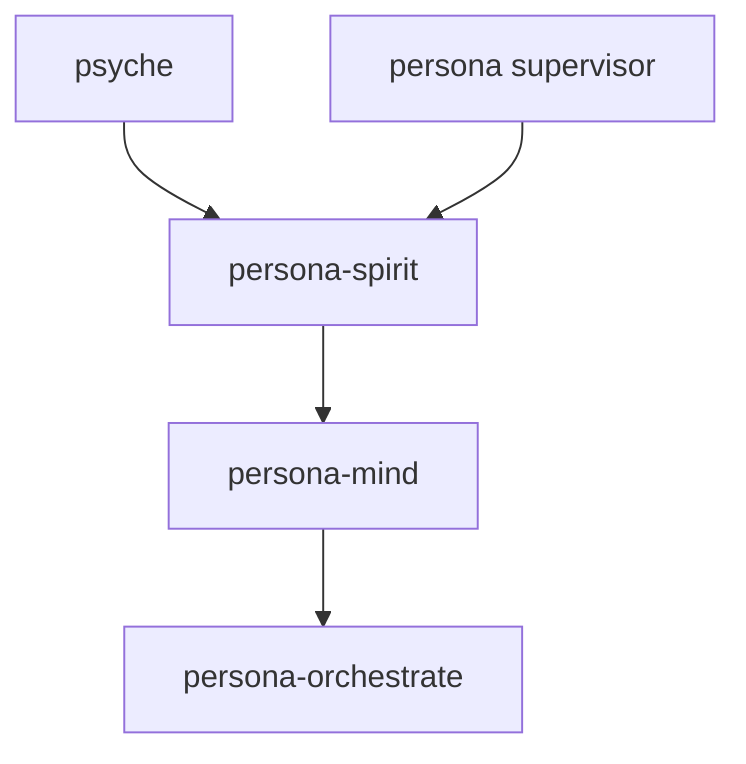
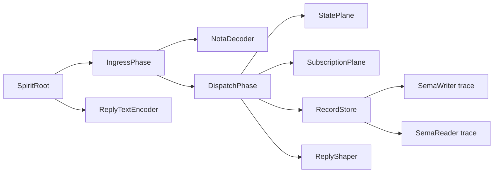

# persona-spirit — architecture

*Psyche ↔ mind interface; apex cognitive component of Persona.*

## Role

`persona-spirit` receives psyche statements, captures intent, and projects
typed intent into `persona-mind`. It is the cognitive authority above mind.
The supervisor has higher infrastructure permission only for process
lifecycle.

`persona-spirit` follows the component triad:

- `persona-spirit` — runtime daemon + thin CLI.
- `signal-persona-spirit` — ordinary peer-callable contract.
- `owner-signal-persona-spirit` — supervisor-only owner contract.

## Authority



Spirit is spawned last because it depends on the components it commands.

## State

`persona-spirit` owns one sema-engine database: `persona-spirit.redb`.

Policy state is seeded once from `bootstrap-policy.nota`, then changed only
through `owner-signal-persona-spirit`. Working state records captured intent,
psyche presence, pending clarification questions, and downstream owner-Mutate
audit once the runtime lands.

## Actor topology

The current CLI path starts and stops a Kameo actor tree per invocation. This
is still a raw component slice, not the final daemon socket runtime, but it
uses the same logic planes the daemon will keep alive:



`RecordStore` owns `SpiritStore`, which owns the sema-engine handle. It runs as
the store plane. `StatePlane` owns current psyche state and pending
clarification questions. `SubscriptionPlane` owns subscription tokens and live
stream registrations. Request decoding, dispatch, unimplemented-reply shaping,
and NOTA reply rendering are separate actor planes. `ActorTrace` is a runtime
witness, not an audit log: tests assert the expected actor path for each
constraint.

The daemon socket path does not pretend RKYV Signal traffic is text. It reads
length-prefixed `signal-persona-spirit::Frame` values, checks the
`signal-core::Request`, and submits each `SpiritRequest` directly to
`SpiritRoot` through the dispatch plane. The NOTA decoder remains a CLI/text
ingress actor only. The CLI can still run in raw one-shot mode, but it can also
decode one NOTA request and forward it to a running daemon socket.

## Constraints

| Constraint | Witness |
|---|---|
| The CLI binary accepts exactly one argument. | `tests/boundary.rs` checks missing and extra arguments. |
| The daemon binary accepts exactly one argument. | `tests/boundary.rs` checks the shared argument parser. |
| The CLI type-checks one `signal-persona-spirit::SpiritRequest`. | `tests/boundary.rs` checks valid `Statement`, `Entry`, and `RecordObservation` requests. |
| The CLI request path uses the Kameo actor tree. | `persona_spirit_command_line_path_uses_actor_runtime` checks the CLI path delegates to `SpiritActorRuntime`. |
| Kameo is the only actor runtime dependency. | `persona_spirit_uses_kameo_as_only_actor_runtime` scans the manifest. |
| Actor types are data-bearing, not public zero-sized actor nouns. | `persona_spirit_actor_types_are_data_bearing` checks each named actor has a struct body. |
| `Entry` assertions traverse root, ingress, decoder, dispatch, store, sema writer, and reply encoder. | `persona_spirit_entry_assertion_runs_through_actor_planes` checks `ActorTrace` ordering. |
| `Entry` assertions persist a top-level record. | `persona_spirit_client_asserts_entry_and_mints_record_identifier` checks `RecordAccepted`. |
| Spirit mints `RecordIdentifier`; agents never submit it. | `persona_spirit_client_asserts_entry_and_mints_record_identifier` sends no identifier and receives one. |
| Repeated similar entries remain distinct records. | `persona_spirit_client_repeated_entries_remain_distinct_records` stores two matching summaries. |
| Record observations use the read plane and not the write plane. | `persona_spirit_record_observation_uses_read_plane_without_write_plane` checks `SemaReader` without `SemaWriter`. |
| Psyche-state observations use a working-state plane, not record storage. | `persona_spirit_state_observation_uses_state_plane` checks `StatePlane` without `RecordStore`. |
| Pending-question observations use the working-state plane. | `persona_spirit_question_observation_uses_state_plane` and `persona_spirit_client_observes_empty_pending_questions` check the empty raw state. |
| State subscriptions snapshot current psyche state through the state plane before opening a stream. | `persona_spirit_state_subscription_uses_subscription_plane_after_state_snapshot` checks `StatePlane` before `SubscriptionPlane`. |
| Record subscriptions snapshot record summaries through the read plane before opening a stream. | `persona_spirit_record_subscription_uses_read_plane_then_subscription_plane` checks `SemaReader` before `SubscriptionPlane`. |
| Subscription retractions use the subscription plane and return typed retraction acknowledgements. | `persona_spirit_subscription_retractions_use_subscription_plane` checks `StateSubscriptionRetracted` and `RecordSubscriptionRetracted`. |
| Summary queries do not include provenance. | `persona_spirit_client_persists_entries_for_later_summary_observation` checks `RecordsObserved`. |
| Provenance appears only when requested. | `persona_spirit_client_returns_provenance_only_when_requested` checks `RecordProvenancesObserved`. |
| Valid unimplemented requests do not touch the store. | `persona_spirit_unimplemented_statement_uses_reply_shaper_not_store` checks `ReplyShaper` and absence of `RecordStore`. |
| Invalid NOTA keeps a typed decode error through the actor path. | `persona_spirit_invalid_text_keeps_typed_decode_error` checks `Error::InvalidSpiritRequest`. |
| Shutdown releases the store so a later runtime can reopen the same path. | `persona_spirit_shutdown_releases_store_for_restart` writes, stops, restarts, and reads. |
| The daemon configuration is a single untagged NOTA struct record. | `persona_spirit_daemon_configuration_is_one_nota_record` round-trips the config and rejects a variant wrapper shape. |
| The daemon serves length-prefixed Signal frames through the actor root. | `persona_spirit_daemon_serves_signal_frames_through_actor_root` writes and reads through a real Unix socket. |
| The daemon rejects verb/payload mismatch before actor execution. | `persona_spirit_daemon_rejects_verb_payload_mismatch_before_actor_execution` constructs a bad `signal-core::Request`. |
| Signal-frame daemon ingress does not route through the NOTA decoder. | `persona_spirit_daemon_source_does_not_route_signal_frames_through_nota_decoder` checks the socket boundary calls `SubmitRequest`. |
| The CLI can act as a daemon client without bypassing Signal. | `persona_spirit_client_can_send_nota_request_to_running_daemon` decodes NOTA then sends a Signal frame to the socket. |
| No classifier or mind-forwarding behavior exists until its intent is clear. | Status section says this explicitly. |

## Code Map

```text
src/lib.rs                         — module entry
src/argument.rs                    — one-argument boundary
src/daemon.rs                      — daemon configuration, socket binding, frame codec, signal client
src/error.rs                       — typed error
src/runtime.rs                     — CLI boundary that delegates into SpiritActorRuntime
src/store.rs                       — sema-engine backed entry store and record queries
src/actors/root.rs                 — Kameo root and blocking one-shot runtime helper
src/actors/ingress.rs              — text ingress phase
src/actors/decoder.rs              — strict NOTA request decoder actor
src/actors/dispatch.rs             — request dispatch actor
src/actors/state.rs                — psyche-state and pending-question working-state actor
src/actors/subscription.rs         — subscription token and stream registration actor
src/actors/store.rs                — sema-engine store actor
src/actors/reply.rs                — unimplemented reply shaper + NOTA reply encoder actors
src/actors/trace.rs                — actor-path witness values
src/actors/pipeline.rs             — typed in-process pipeline carriers
src/bin/persona-spirit.rs          — thin CLI binary
src/bin/persona-spirit-daemon.rs   — daemon binary
bootstrap-policy.nota              — first policy seed placeholder
tests/boundary.rs                  — argument-boundary witnesses
tests/actor_runtime.rs             — actor-path and architectural-truth witnesses
tests/daemon.rs                    — socket, signal-frame, and daemon-boundary witnesses
```

## Status

Implemented now:

- repo scaffold;
- daemon and CLI binary names;
- one-argument boundary parser;
- typed CLI request decoding for `signal-persona-spirit::SpiritRequest`;
- Kameo actor tree for the CLI request path;
- `persona-spirit-daemon` typed configuration and Unix socket binding;
- length-prefixed RKYV Signal frame request/reply path over the daemon socket;
- CLI socket-client mode for a running daemon;
- actor trace witnesses for root, ingress, decode, dispatch, store, sema
  writer/reader, working state, reply shaping, and reply encoding;
- sema-engine backed `Entry` assertion;
- `RecordObservation` summary and provenance queries;
- `StateObservation` with default absent psyche state;
- `QuestionPending` with an empty pending-question set;
- `SubscribeState` and `SubscribeRecords` with snapshot-open replies;
- state and record subscription retractions with typed close acknowledgements;
- typed `RequestUnimplemented` NOTA replies for behavior not built yet;
- dependency on the ordinary and owner spirit contracts.

Not implemented:

- intent classifier;
- owner-Mutate forwarding to mind;
- subscription event delivery;
- owner-signal lifecycle handling;
- bootstrap-policy import;
- filesystem intent projection.

The next implementation step is subscription event delivery or owner lifecycle
handling.
Spirit-to-mind owner variants are not needed for the current raw CLI/storage
slice.
