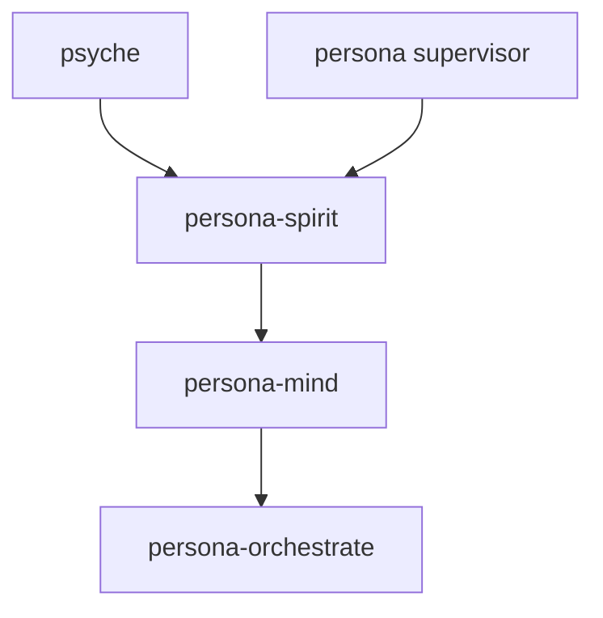

# persona-spirit — architecture

*Psyche ↔ mind interface; apex cognitive component of Persona.*

## Role

`persona-spirit` receives psyche statements, captures intent, and projects
typed intent into `persona-mind`. It is the cognitive authority above mind.
The supervisor has higher infrastructure permission only for process
lifecycle.

`persona-spirit` follows the component triad:

- `persona-spirit` — runtime daemon + thin CLI.
- `signal-persona-spirit` — ordinary peer-callable contract.
- `owner-signal-persona-spirit` — supervisor-only owner contract.

## Authority



Spirit is spawned last because it depends on the components it commands.

## State

`persona-spirit` owns one sema-engine database: `persona-spirit.redb`.

Policy state is seeded once from `bootstrap-policy.nota`, then changed only
through `owner-signal-persona-spirit`. Working state records captured intent,
psyche presence, pending clarification questions, and downstream owner-Mutate
audit once the runtime lands.

## Constraints

| Constraint | Witness |
|---|---|
| The CLI binary accepts exactly one argument. | `tests/boundary.rs` checks missing and extra arguments. |
| The daemon binary accepts exactly one argument. | `tests/boundary.rs` checks the shared argument parser. |
| The CLI type-checks one `signal-persona-spirit::SpiritRequest`. | `tests/boundary.rs` checks valid `PsycheStatement` and `IntentEntry` requests. |
| Valid CLI requests return one typed NOTA reply. | The current reply is `SpiritRequestUnimplemented`, naming the accepted operation honestly. |
| No classifier or mind-forwarding behavior exists until its intent is clear. | Status section says this explicitly. |

## Code Map

```text
src/lib.rs                         — module entry
src/argument.rs                    — one-argument boundary
src/error.rs                       — typed error
src/runtime.rs                     — CLI request decoding + honest not-built-yet reply
src/bin/persona-spirit.rs          — thin CLI binary
src/bin/persona-spirit-daemon.rs   — daemon binary
bootstrap-policy.nota              — first policy seed placeholder
tests/boundary.rs                  — argument-boundary witnesses
```

## Status

Implemented now:

- repo scaffold;
- daemon and CLI binary names;
- one-argument boundary parser;
- typed CLI request decoding for `signal-persona-spirit::SpiritRequest`;
- typed `SpiritRequestUnimplemented` NOTA replies for valid requests;
- dependency on the ordinary and owner spirit contracts.

Not implemented:

- daemon socket listener;
- Kameo actor tree;
- sema-engine tables;
- intent classifier;
- owner-Mutate forwarding to mind;
- filesystem intent projection.

The next implementation step needs the daemon configuration and socket shape
for spirit. Spirit-to-mind owner variants are not needed for the current raw
CLI/type-checking slice.
